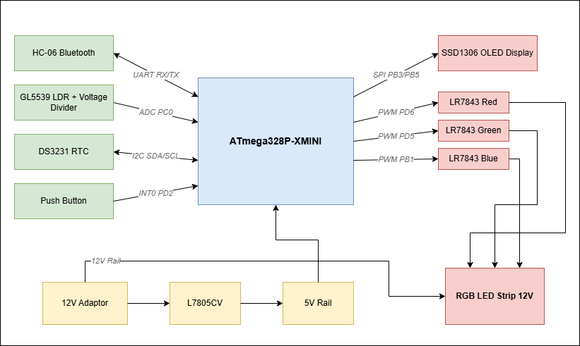
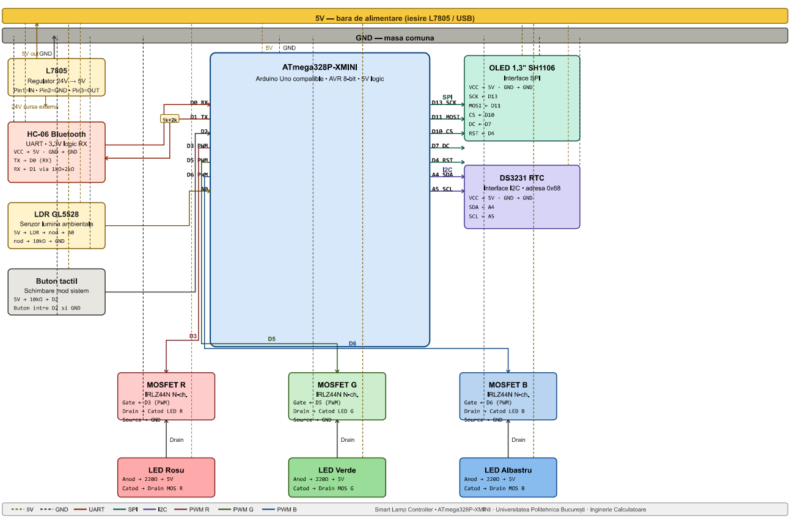
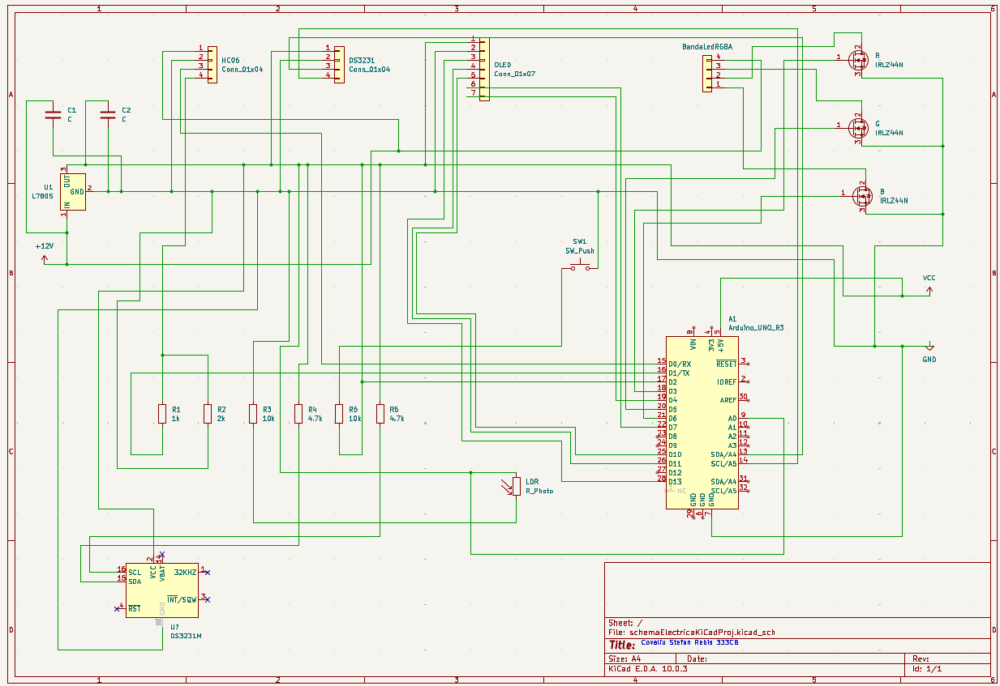
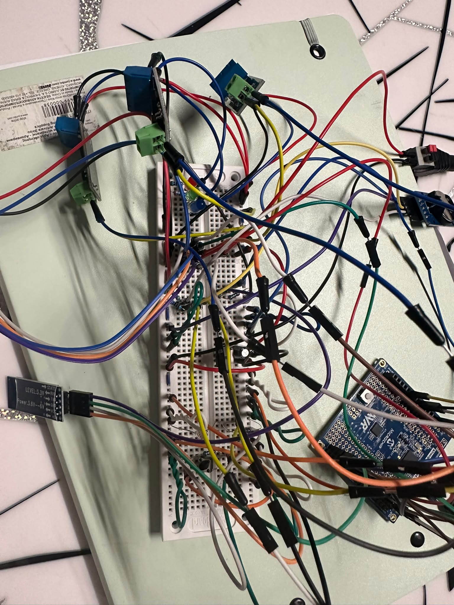
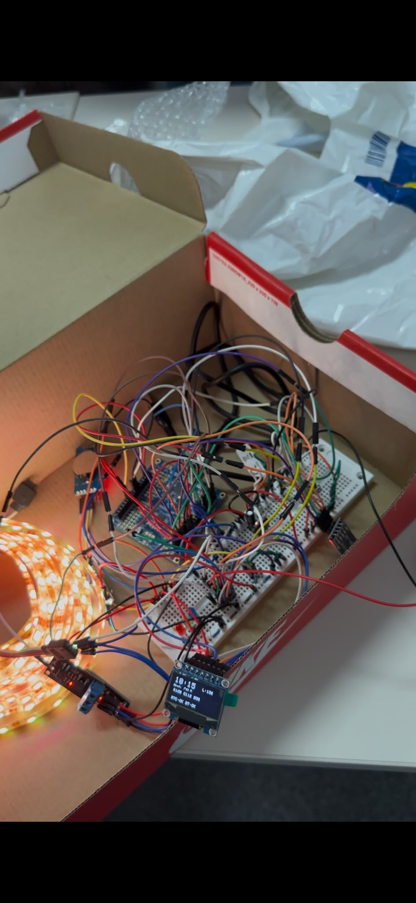
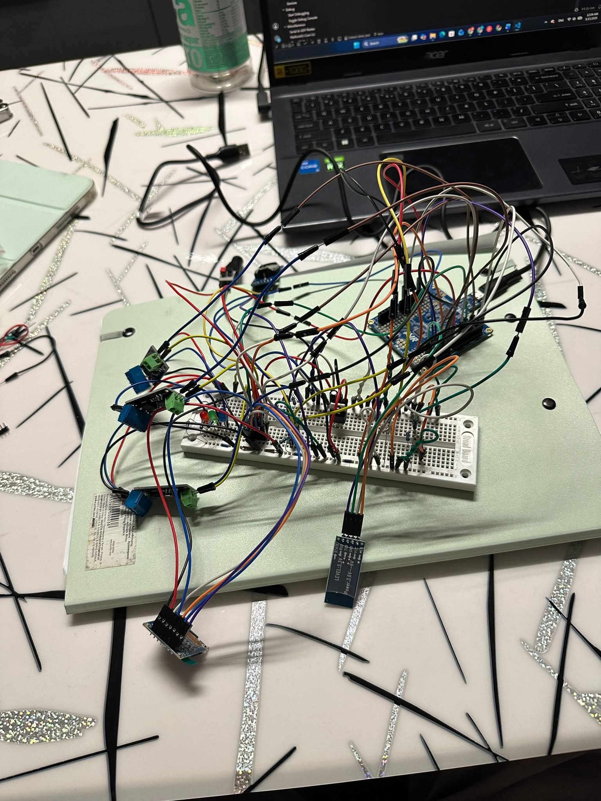

# Lampa RGB Inteligenta cu Adaptare Automata a Culorii

**Smart Lamp Controller**: Proiect PM, Universitatea Politehnica Bucuresti, Inginerie Calculatoare 2026



## Descriere

Lampa RGB controlata de un microcontroler ATmega328P-XMINI care isi adapteaza automat temperatura de culoare in functie de luminozitatea ambientala si ora din zi. Trece de la lumina rece (albastru-alb) ziua la lumina calda (galben-portocaliu) seara, pentru a reduce efectele luminii albastre asupra somnului.

Pe langa modul automat, lampa poate fi controlata manual printr-un buton fizic sau de pe telefon prin Bluetooth. Un display OLED afiseaza in timp real modul activ, culoarea curenta si ora.

## Demo

[Video Demo](LINK_VIDEO_DEMO)


## Moduri de functionare

| Mod | Trigger | Descriere |
|---|---|---|
| AUTO | implicit | LDR determina temperatura culorii |
| TIME | buton / BT | RTC determina temperatura in functie de ora |
| WARM | buton / BT | Fix culoare calda (R=255, G=180, B=80) |
| COOL | buton / BT | Fix culoare rece (R=200, G=220, B=255) |
| WHITE | buton / BT | Alb pur (R=255, G=255, B=255) |
| OFF | buton / BT | Stins |
| BT | Bluetooth | Culoare custom trimisa de pe telefon |

Prioritate: **Buton > Bluetooth > Mod automat**

## Hardware

### Lista componente

| Componenta | Model | Cantitate |
|---|---|---|
| Microcontroller | ATmega328P-XMINI | 1 |
| Modul Bluetooth | HC-06 RS232 | 1 |
| Display OLED | SSD1306 0.96" SPI, 7 pini | 1 |
| Modul RTC | DS3231 AT24C32 IIC | 1 |
| Baterie RTC | CR2032 3V | 1 |
| MOSFET | LR7843 N-Channel Logic Level | 3 |
| Fotorezistor | GL5528 LDR | 1 |
| Buton | Microswitch 6x6x6mm | 1 |
| Regulator tensiune | L7805CV 5V | 1 |
| Rezistor | 220Ω | 3 |
| Rezistor | 10kΩ | 2 |
| Rezistor | 1kΩ | 1 |
| Rezistor | 2kΩ | 1 |
| Condensator | 100nF | 2 |
| Condensator | 10uF | 1 |
| Conector DC | 5.5x2.1mm mama | 1 |
| Banda LED RGB | 5m, kit cu alimentator 24V | 1 |
| Sursa alimentare logica | 12V 1000mA, 5.5x2.1mm | 1 |
| Breadboard | 700 contacte | 1 |
| Fire jumper | DuPont M-F + M-M | ~40 |

### Conexiuni pini

| Pin MCU | Conectat la | Functie |
|---|---|---|
| D0 (RX) | HC-06 TX | UART receptie Bluetooth |
| D1 (TX) | HC-06 RX via 1kΩ+2kΩ | UART transmisie (protejat 3.3V) |
| D2 | Buton + pull-up 10kΩ | Intrerupere externa INT0 |
| D3 (PWM) | Gate MOSFET Verde | PWM canal G: Timer2 OC2B |
| D4 | OLED RST | SPI Reset |
| D5 (PWM) | Gate MOSFET Rosu | PWM canal R: Timer0 OC0B |
| D6 (PWM) | Gate MOSFET Albastru | PWM canal B: Timer0 OC0A |
| D7 | OLED DC | SPI Data/Command |
| D10 | OLED CS | SPI Chip Select |
| D11 (MOSI) | OLED MOSI | SPI Date |
| D13 (SCK) | OLED SCK | SPI Clock |
| A0 | Nod LDR + 10kΩ | ADC citire luminozitate |
| A4 (SDA) | DS3231 SDA | I2C date RTC |
| A5 (SCL) | DS3231 SCL | I2C clock RTC |

### Schema electrica





## Software

### Mediu de dezvoltare

- **IDE:** VSCode cu PlatformIO
- **Framework:** Arduino
- **Upload:** avrdude cu protocol custom `-P usb -c xplainedmini`
- **Monitor serial:** 9600 baud

### Biblioteci

| Biblioteca | Scop |
|---|---|
| `Wire.h` | Comunicatie I2C cu DS3231 |
| `RTClib` | Citire ora si data de la DS3231 |
| `SPI.h` | Comunicatie SPI hardware cu OLED |
| `Adafruit_GFX` | Biblioteca grafica pentru display |
| `Adafruit_SSD1306` | Driver OLED SSD1306 prin SPI |

### Structura proiect

```
LampaRGB/
├── src/
│   └── main.cpp
├── platformio.ini
└── README.md
```

### platformio.ini

```ini
[env:ATmega328P_XMINI]
platform = atmelavr
board = ATmega328P_XMINI
framework = arduino
upload_protocol = custom
upload_flags =
    -C
    ${platformio.packages_dir}/tool-avrdude/avrdude.conf
    -p
    atmega328p
    -P
    usb
    -c
    xplainedmini
upload_command = avrdude $UPLOAD_FLAGS -U flash:w:$SOURCE:i
monitor_speed = 9600
```

### Algoritm principal

```cpp
void loop() {
    parseBT();       // 1. Citeste comenzi UART de la HC-06
    checkButton();   // 2. Verifica buton cu debouncing software

    // 3. Calcul culoare in functie de mod activ
    // MODE_AUTO  => t = 255 - ADC_LDR
    // MODE_TIME  => t = f(ora RTC)
    // MODE_WARM  => t = 255 (fix cald)
    // MODE_COOL  => t = 0   (fix rece)

    // Interpolare liniara
    R = RECE_R + (CALD_R - RECE_R) * t / 255;
    G = RECE_G + (CALD_G - RECE_G) * t / 255;
    B = RECE_B + (CALD_B - RECE_B) * t / 255;

    setRGB(cap(R), cap(G), cap(B));   // Aplica PWM
    updateOLED(...);                   // Actualizeaza display
}
```

### Formule

**Interpolare temperatura culoare:**
```
R = RECE_R + (CALD_R - RECE_R) * t / 255
t = 0   => RECE (R=200, G=220, B=255)
t = 255 => CALD (R=255, G=180, B=80)
```

**Factorul t din ora (MODE_TIME):**
```
06:00-18:00 => t = 0
18:00-22:00 => t = (h - 18) * 255 / 4
22:00-06:00 => t = 255
```

**Limitare luminozitate:**
```
val_finala = val_calculata * MAX_BRIGHT / 255
MAX_BRIGHT = 160
```

**Curent LED-uri:**
```
I_R = (5V - 2.0V) / 220Ω = 13.6 mA
I_G = (5V - 2.1V) / 100Ω = 29 mA
I_B = (5V - 3.2V) / 220Ω =  8 mA
```

## Comenzi Bluetooth

Conecteaza telefonul la HC-06 (PIN: `1234`) cu o aplicatie serial Bluetooth (ex: Serial Bluetooth Terminal).

| Comanda | Efect |
|---|---|
| `WARM` | Culoare calda |
| `COOL` | Culoare rece |
| `WHITE` | Alb pur |
| `TIME` | Mod automat dupa ora |
| `AUTO` | Mod automat dupa LDR |
| `OFF` | Stinge lampa |
| `200 50 10` | Culoare custom R G B (0-255) |

## Testare

**Buton:** Apasa butonul de pe D2. Display-ul cicleza: AUTO, CALD, RECE, ALB, TIME, OPRIT.

**Bluetooth:** Trimite comenzile de mai sus din aplicatia de pe telefon.

**LDR:** Acopera fotorezistorul cu mana in modul AUTO. LED-urile vireze spre cald. Descopera, vireze spre rece.

**RTC:** In modul TIME, culoarea se schimba in functie de ora afisata pe OLED.

**Debug serial:** Deschide Serial Monitor la 9600 baud. La fiecare 2 secunde:
```
HH:MM:SS | L:xxx | R:xxx G:xxx B:xxx
```

## Poze







## Resurse

- [Pagina OCW PM](https://ocw.cs.pub.ro/courses/pm/prj2026/atoader/stefan.covaliu)
- [Datasheet ATmega328P](https://ww1.microchip.com/downloads/en/DeviceDoc/Atmel-7810-Automotive-Microcontrollers-ATmega328P_Datasheet.pdf)
- [Datasheet LR7843](https://www.lcsc.com/datasheet/lcsc_datasheet_2404201602_SLKOR-SLR7843_C148437.pdf)
- [Datasheet DS3231](https://datasheets.maximintegrated.com/en/ds/DS3231.pdf)
- [Datasheet L7805CV](https://www.st.com/resource/en/datasheet/l78.pdf)
- [RTClib - Adafruit](https://github.com/adafruit/RTClib)
- [U8g2 OLED driver](https://github.com/olikraus/u8g2)

## Jurnal

- **Saptamana 1**: alegerea componentelor, comanda, documentare
- **Saptamana 2**: asamblare breadboard, testare alimentare si GPIO
- **Saptamana 3**: implementare UART (HC-06), PWM (MOSFETs), ADC (LDR)
- **Saptamana 4**: implementare I2C (DS3231), SPI (OLED), integrare logica completa
- **Saptamana 5**: testare finala, documentatie OCW si GitHub

*Universitatea Politehnica Bucuresti: PM 2026*
